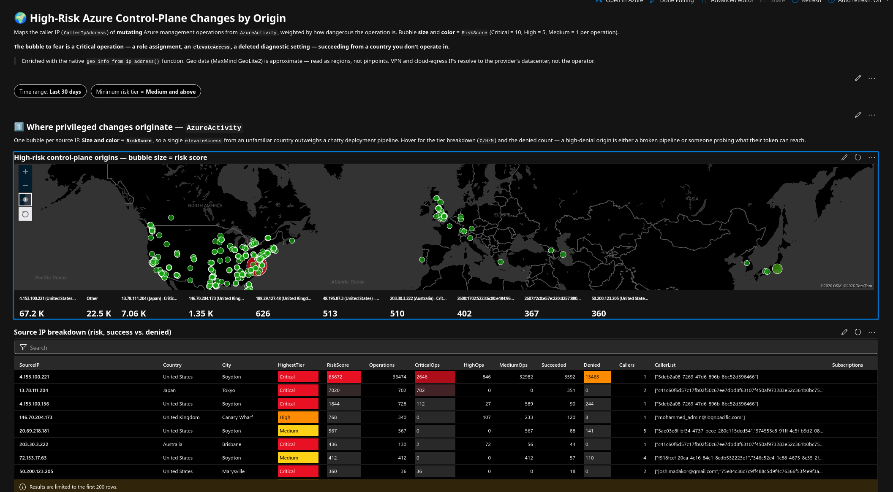

# Sentinel Risk-Tiered Geo Map — Azure Control-Plane Changes

A Microsoft Sentinel workbook that geolocates the caller IP behind every
*mutating* Azure management operation, weights each one by how dangerous the
operation is, and plots the result as a risk-scored map.

## The problem it addresses

`AzureActivity` logs every management-plane call, but treating all
write/delete/action operations as equally important buries the signal:
a role assignment from an unfamiliar country is not the same event as a
routine deployment. This workbook classifies operations into risk tiers
before they ever reach the map, so bubble size reflects *danger*, not
just *volume*.

## Risk tiers

| Tier | Weight | Example operations |
|---|---|---|
| **Critical** | 10 | Role assignments, `elevateAccess`, deleting diagnostic settings or alert rules |
| **High** | 5 | Key Vault secret/access changes, NSG and firewall rule changes, storage key regeneration |
| **Medium** | 1 | VM run-command/extension changes, SQL firewall rules, Logic App writes |
| *Low (excluded)* | — | Routine operational writes not in the lists above |

## What's in this folder

| File | Contents |
|---|---|
| [`azure-activity-georisk-workbook.json`](./azure-activity-georisk-workbook.json) | Full workbook: parameterized time range and minimum-risk-tier filter, summary tiles, risk-scored map, timeline by tier, per-IP and per-caller breakdown tables |
| [`screenshots/`](./screenshots) | Rendered workbook view — risk-scored map with live control-plane data |

## Skills demonstrated

Microsoft Sentinel Workbooks · KQL · Azure control-plane telemetry ·
risk-based detection design · `geo_info_from_ip_address()` enrichment
