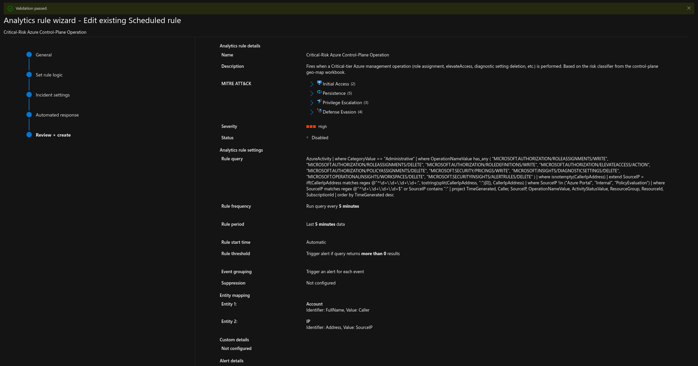
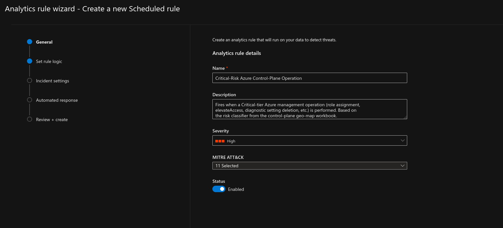
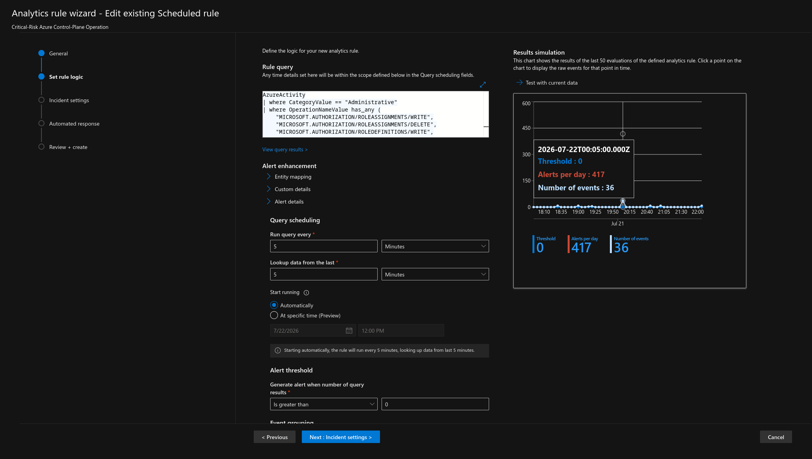
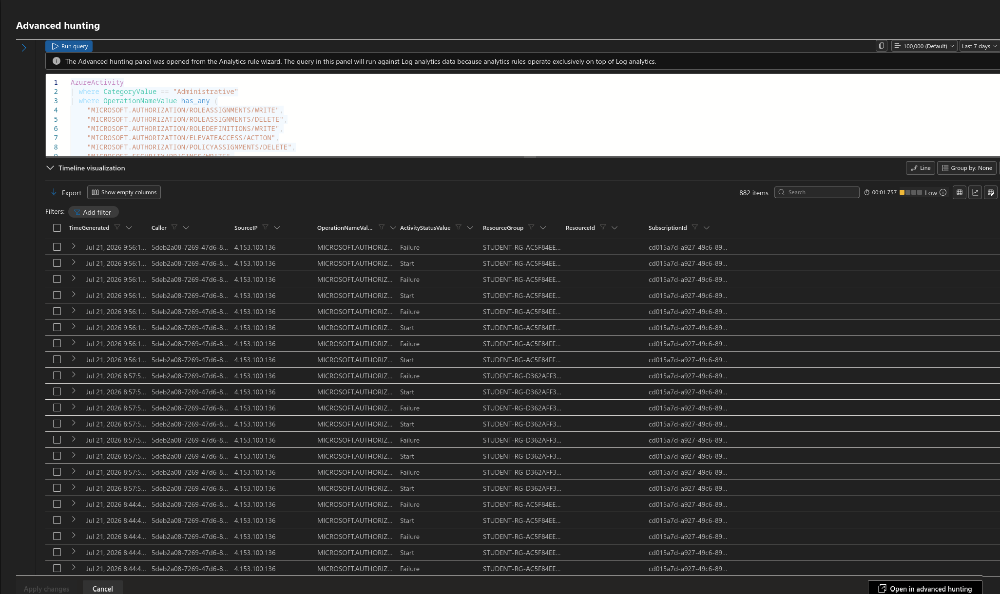
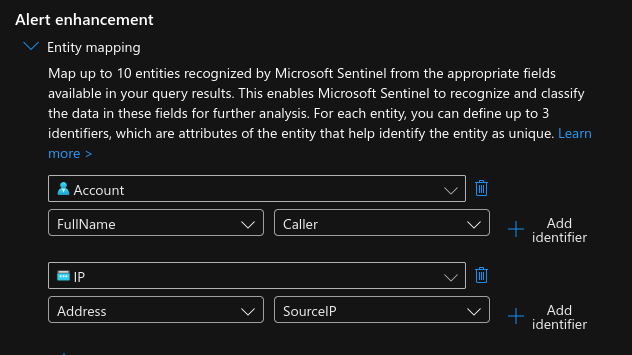
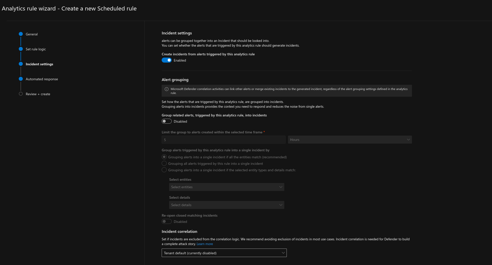

# Sentinel Analytics Rule — Critical-Risk Control-Plane Operations

Converts the Critical tier from the [geo-map workbook](../02-sentinel-geomap)
risk classifier into a live Sentinel analytics rule with entity mapping,
rather than leaving that logic in a passive dashboard.

> **Lab exercise, shared environment.** Built and tested in a shared
> community cyber-range. No automated response (Teams/Jira) was wired to
> this rule to avoid triggering shared infrastructure. The rule was
> disabled after capturing these artifacts.

## What's in this folder

| File | Contents |
|---|---|
| [`analytics-rule.json`](./analytics-rule.json) | Exported rule definition — query, scheduling, entity mappings, MITRE ATT&CK techniques |
| [`screenshots/`](./screenshots) | Wizard configuration, step by step |

## Configuration walkthrough

**General** — name, description, severity, and MITRE ATT&CK techniques.

**Rule query and scheduling** — the Critical-tier KQL, run frequency, and
alert threshold, alongside the results simulation showing the query
returning real matches.

**Entity mapping** — Account (Caller) and IP (SourceIP), so incidents carry
the context an analyst needs without manual lookup.

**Incident settings** — alert-to-incident grouping deliberately disabled
(see Design decisions below).

## Design decisions

- **Critical tier only, not the full classifier.** A High-severity rule
  shouldn't carry logic for tiers already judged less urgent — Medium/High
  operations would need their own rule with their own severity.
- **Per-event alerting, no aggregation.** The workbook aggregates by IP for
  visualization; this rule intentionally does the opposite — one incident
  per Critical event, so unrelated operations aren't pre-bundled before an
  analyst sees them.
- **Alert-to-incident grouping disabled.** Enabling it would silently
  re-merge the per-event alerts the query was built to keep separate.
- **No automated response wired.** The shared workspace already has live
  automation (Jira ticket creation) tied to other naming conventions —
  deliberately avoided touching or triggering it.

## Validating it fires

Tested by assigning a scoped Reader role on a personal resource group —
a minimal, reversible `roleAssignments/write` operation matching the
Critical tier. The range's student permissions blocked the IAM write
outright, which is itself a useful finding: the environment restricts
role-assignment changes even for low-privilege, self-scoped test actions.
That's the same least-privilege principle worth applying to a real
production tenant, and it's why this rule is validated by query logic and
configuration review rather than a live-fire incident screenshot.

## Skills demonstrated

Sentinel analytics rule authoring · entity mapping · MITRE ATT&CK mapping ·
incident grouping and alert-threshold design · safe testing practices in
shared/multi-tenant lab environments
