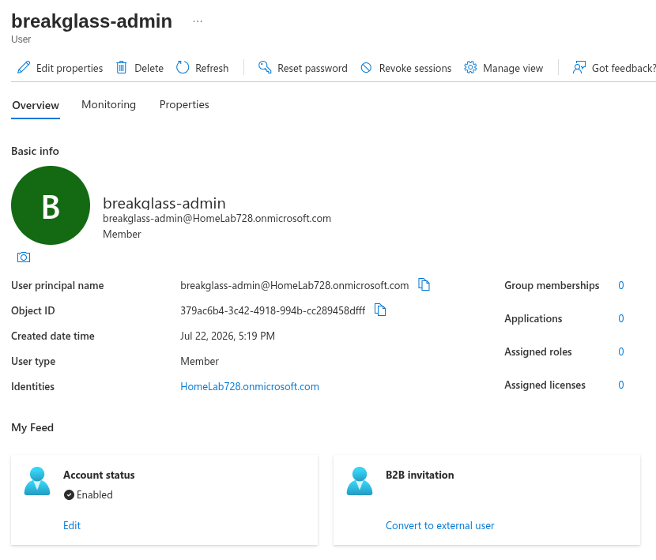
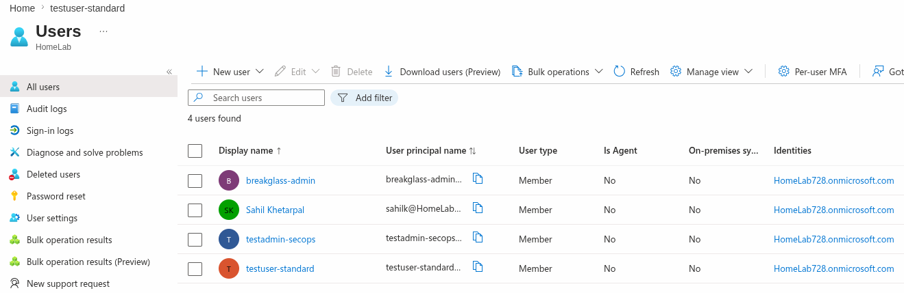
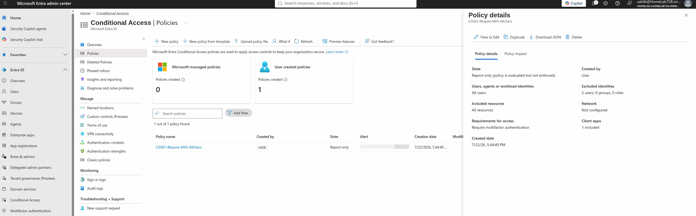
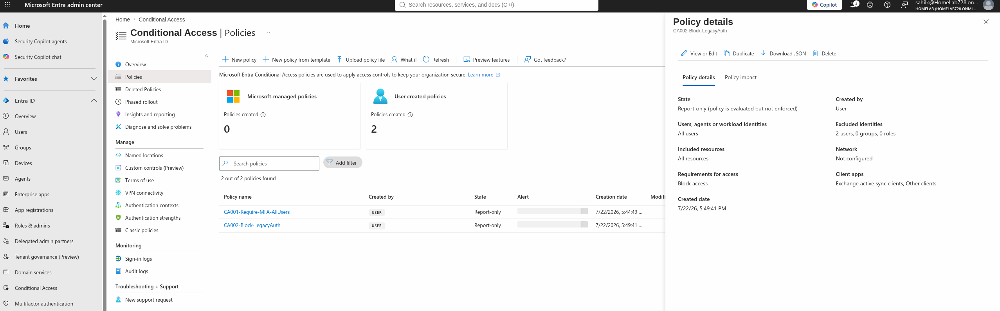
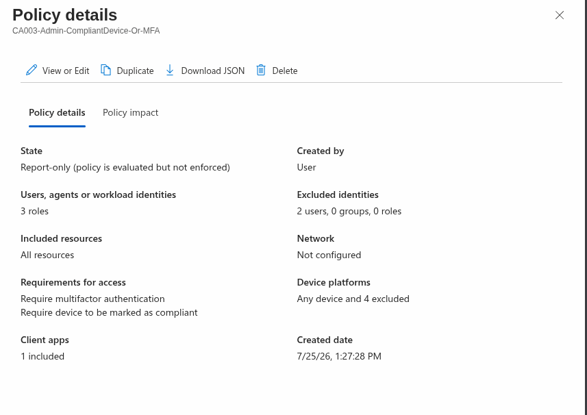
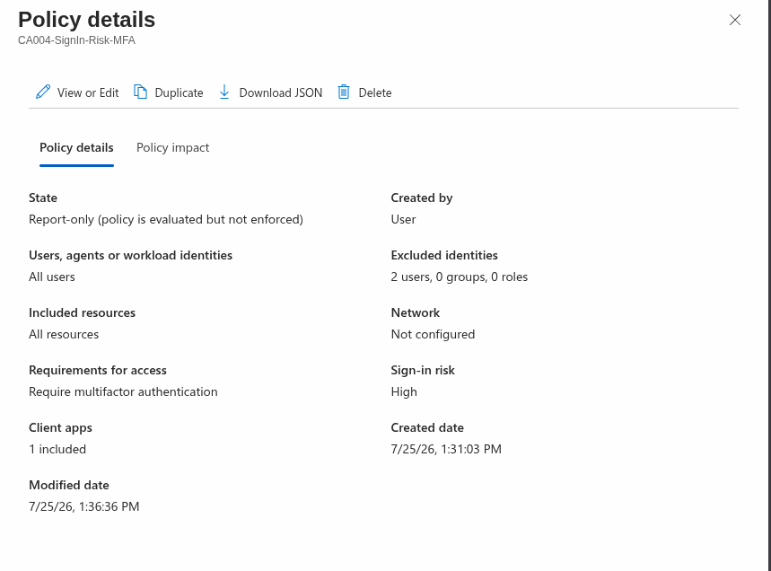
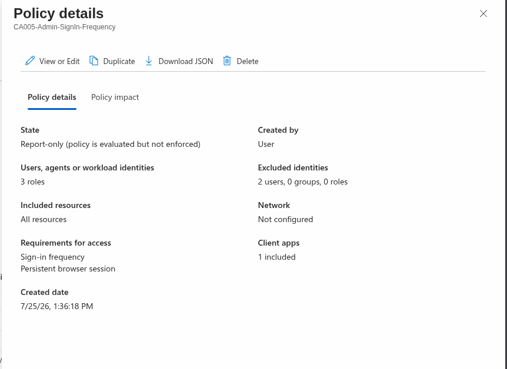
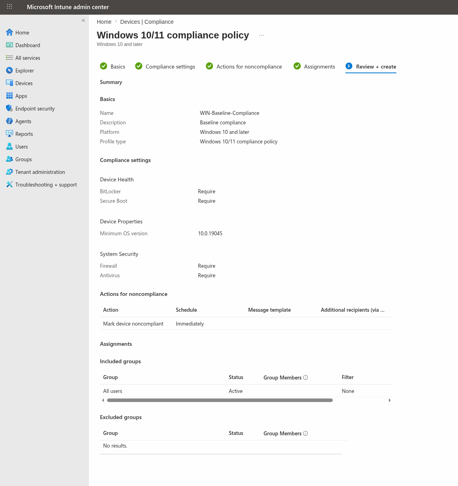
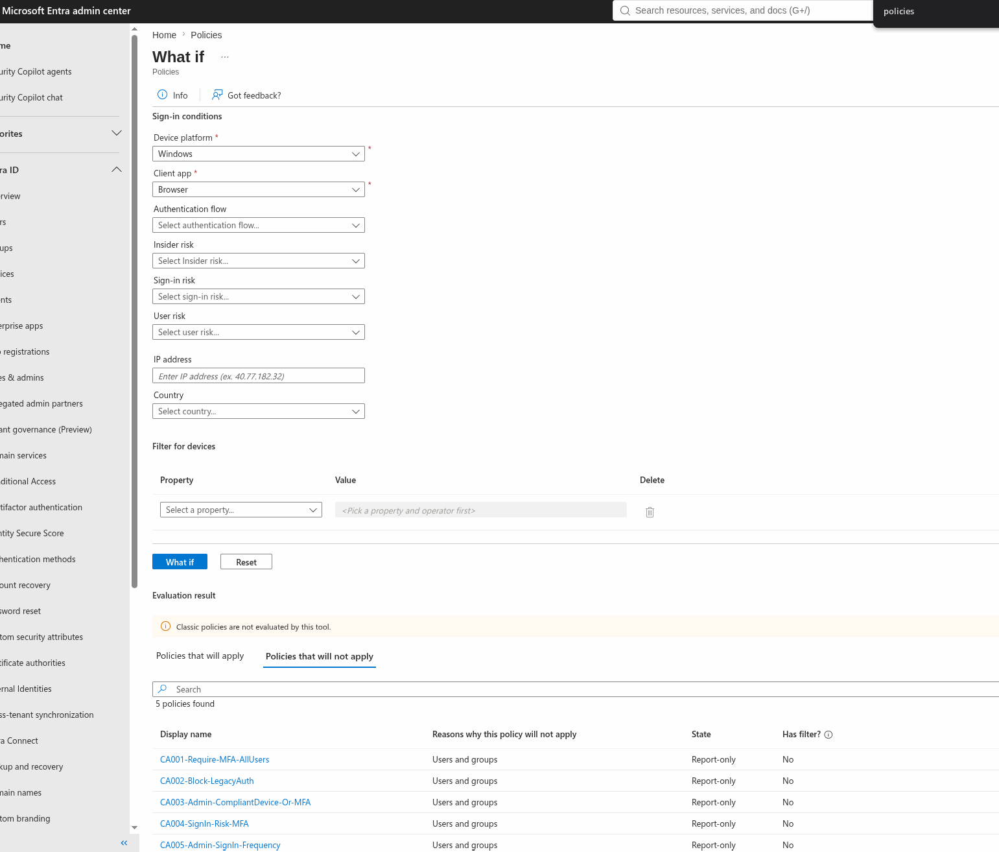

# Zero Trust / Conditional Access Policy Design

Five Microsoft Entra Conditional Access policies plus one Intune device
compliance policy, built in a personal Microsoft 365 E5 trial tenant to
demonstrate Zero Trust identity controls — the first bullet under this
role's "Key Responsibilities."

> **Lab exercise, personal tenant.** Built in a Microsoft 365 E5 trial
> (`homelab728.onmicrosoft.com`) with a break-glass admin account and
> synthetic test users. All identifiers in the exported JSON are redacted.

## What's in this folder

| File | Contents |
|---|---|
| [`policies/ca-policies-export-redacted.json`](./policies/ca-policies-export-redacted.json) | All five CA policies, exported via Microsoft Graph PowerShell |
| [`policies/intune-compliance-export.json`](./policies/intune-compliance-export.json) | Intune Windows compliance policy |
| [`scripts/Export-CAPolicies.ps1`](./scripts/Export-CAPolicies.ps1) | Exports both, via Graph SDK, read-only scopes |
| [`screenshots/`](./screenshots) | Policy configuration and "What If" simulation results |

## Setup

A break-glass admin account, excluded from every policy, and synthetic
test users representing a standard account and a scoped admin role.

## The policies

| Policy | Scope | Control |
|---|---|---|
| CA001-Require-MFA-AllUsers | All users | Require MFA |
| CA002-Block-LegacyAuth | All users | Block Exchange ActiveSync / other legacy clients |
| CA003-Admin-CompliantDevice-Or-MFA | Global Admin, Security Admin, Privileged Role Admin | Require compliant device OR MFA |
| CA004-SignIn-Risk-MFA | All users | Require MFA on Medium/High sign-in risk |
| CA005-Admin-SignIn-Frequency | Same admin roles as CA003 | 4-hour sign-in frequency, no persistent browser session |

All five were validated with Entra's "What If" tool before any enforcement
decision was made — see Validation below.

## Intune compliance policy (WIN-Baseline-Compliance)

Five settings, each chosen for a specific threat rather than as a general
hardening checklist:

| Setting | Threat it addresses |
|---|---|
| Require BitLocker | Device theft — without disk encryption, physical access is data access |
| Require Secure Boot | Bootkit/rootkit persistence below the OS |
| Minimum OS version (10.0.19045) | Unpatched, publicly known vulnerabilities |
| Require Firewall | Lateral movement and inbound exposure |
| Require Antivirus | Baseline malware detection — also a control auditors ask about by name |

**Deliberately left out:** device password/PIN complexity, on the reasoning
that Windows sign-in requirements are already enforced through Entra ID and
Windows Hello — duplicating that control at the device-compliance layer
risks the two definitions drifting apart over time rather than adding
protection. **Attack Surface Reduction rules** were also left out: they
need per-environment tuning against real software before deployment, and
enabling them blind is a common cause of production outages, not a safe
default for an unvalidated lab policy.

**Known gap:** no devices are enrolled in this tenant, so the policy is
authored and exportable but has never evaluated a real device. CA003's
"compliant device" branch is therefore validated by configuration review,
not live enforcement.

## Report-only vs. enforced

The reason I chose report-only is that in a real-world scenario you would
want to test your policies first and observe how users behave. In an
enterprise environment, setting a policy straight to enforce would create
a headache for the internal support team from every user who missed the
notification email or hadn't yet adjusted to the new requirement.
Additionally, this is a lab with no live traffic to validate against.

## Validation

Rather than trust the policy configuration blind, each policy was checked
against Entra's "What If" tool with predicted outcomes written down before
running it — the same discipline as validating a detection rule before
trusting its output.

Two results were more informative than a clean pass would have been:

- **The admin account (`sahilk@...`) matched zero policies.** It had been
  excluded from all five during the build, which is correct for the build
  phase but not intended as a permanent state — see the report-only/enforced
  decision above.
- **The break-glass account also matched zero policies** — same result,
  opposite meaning. Its exclusion is permanent by design: a break-glass
  account exists specifically to survive an MFA outage or a CA
  misconfiguration, which is why it's protected by a single strong
  credential rather than the layered controls applied to every other
  identity. Publishing a policy set therefore also publishes its exception
  list — the excluded object IDs were redacted from the exported JSON for
  exactly this reason, since the break-glass account's identity is the
  single highest-value target in the tenant.
- **Testing a legacy-auth sign-in showed both CA001 (require MFA) and
  CA002 (block access) matching simultaneously.** Block wins over Require
  when both apply — which is also the correct outcome independent of
  precedence rules, since legacy auth protocols can't perform MFA at all;
  requiring it would functionally just be a slower block.

## Design decisions

- **Break-glass account, excluded from every policy.** Standard Zero Trust
  practice — a Conditional Access misconfiguration or MFA provider outage
  should never be able to lock every admin out of the tenant simultaneously.
- **Report-only before enforced, always.** An untested policy applied to
  "All users" can lock out an entire tenant, including its admins, in one
  save. Report-only evaluates against real sign-in traffic without applying
  the control, so scope and blast radius can be checked first.
- **Grant vs. session controls kept separate.** CA005 uses session controls
  (sign-in frequency, persistent browser session) rather than grant controls,
  because it's constraining how long an already-authenticated admin session
  lasts, not gating the authentication itself.

## Next steps

- **CA006 — block device code flow.** Not built in this iteration.
  Device code authentication is the flow used to connect the PowerShell
  export script to Graph, and it's also a known phishing vector — an
  attacker generates a real code and tricks a user into entering it at
  the legitimate Microsoft login page, receiving a valid token in
  return. Encountered this firsthand while troubleshooting Graph
  authentication for this project; worth constraining via Entra's
  "Authentication flows" condition for identities that have no
  legitimate reason to use it.

## Skills demonstrated

Microsoft Entra Conditional Access · Zero Trust policy design · Intune
device compliance · Microsoft Graph PowerShell SDK · policy validation via
Entra "What If" · least-privilege API scoping (read-only Graph scopes,
verified rather than assumed)
